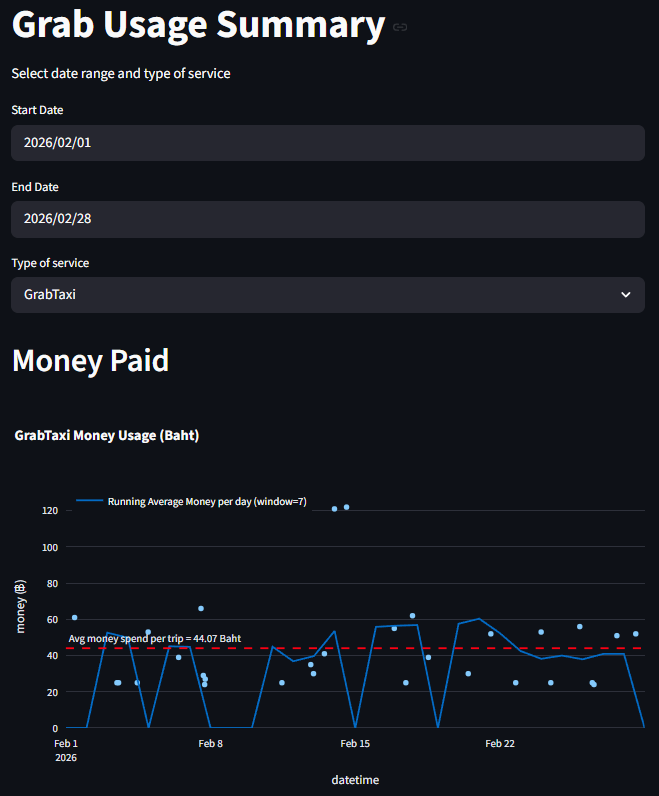

# Grab Usage Export and Summary



## Flow

1. Export Grab E-invoice email by calling Gmail API
   1. [Get Google API credentials](https://developers.google.com/workspace/gmail/api/quickstart/python)
   2. Save credentials file as `credentials/credentials.json`
   3. Get Grab related mail by `python gmail_dump.py` and save them as `data/messages.json`
2. Extract related information by string matching `python extracting_info.py` and save them as `extracted_info.json`
3. Visualization using plotly in streamlit `streamlit run streamlit_export.py`

```bash
python gmail_dump.py
python extracting_info.py
streamlit run streamlit_export.py
```
